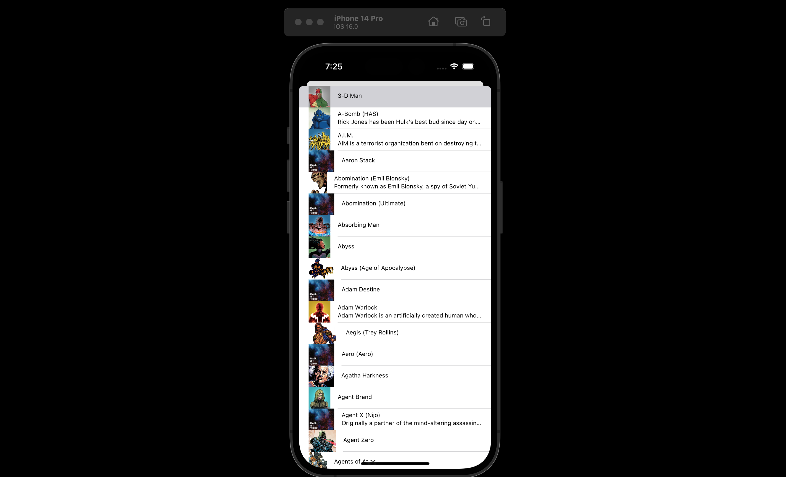
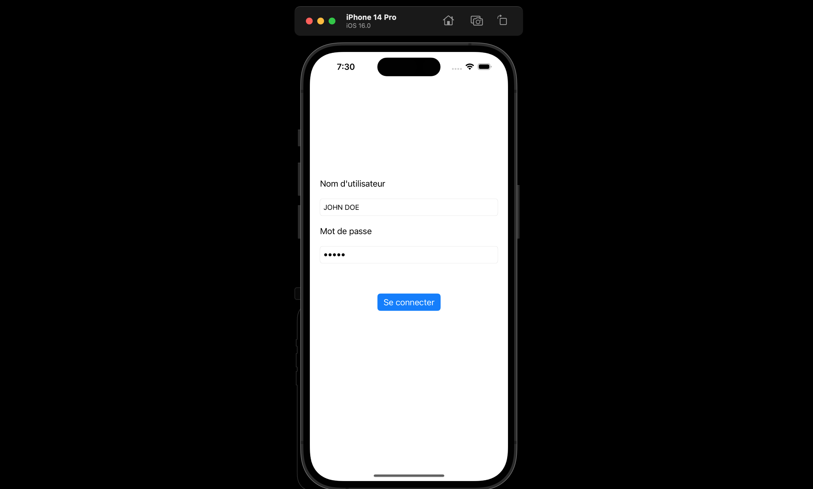
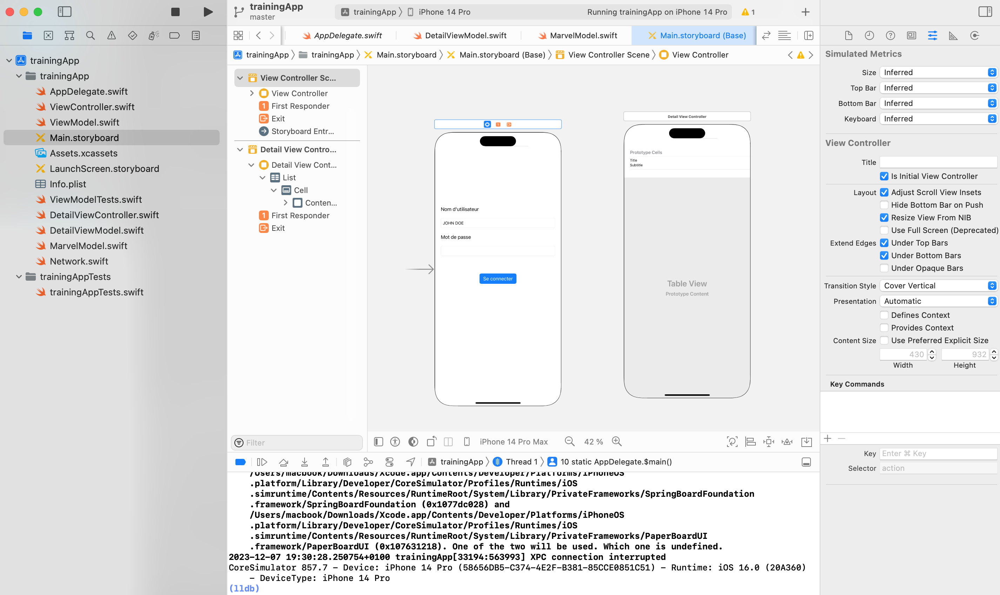

# Application iOS en Swift de Super-Héros Marvel

Application permettant de s'authentifier et de voir les détails de ses héros préférés.

Avec une requête API au site https://developer.marvel.com/ permettant de récupérer une liste de tous les héros Marvels : 
- Le nom des héros
- Une description du héros et de ses pouvoirs
- Une image 

## URL de l'API
```swift
let url = URL(string: "https://gateway.marvel.com:443/v1/public/characters")
```

## Screens de l'application




## Développement XCODE 

